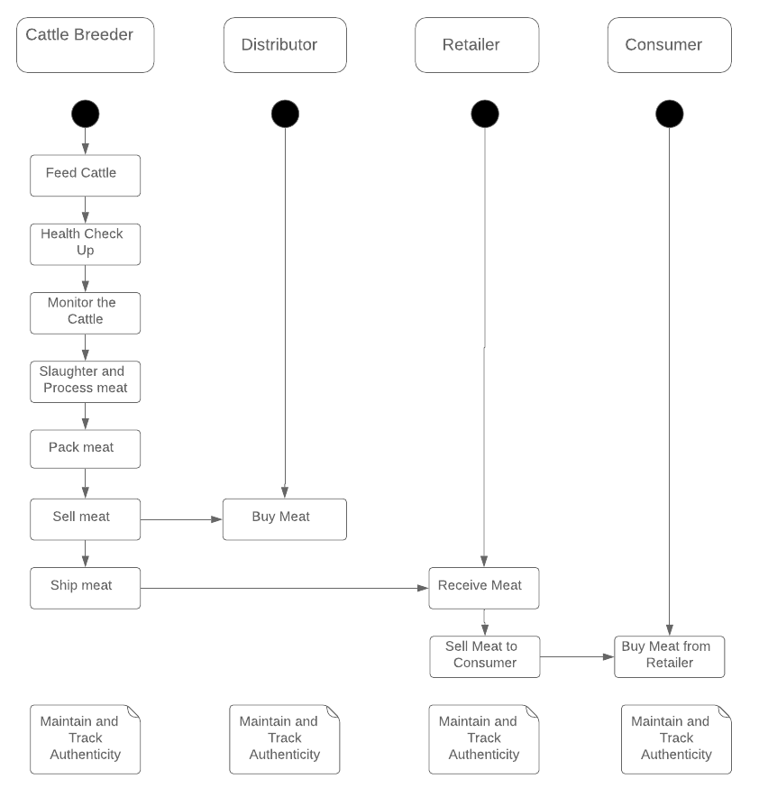
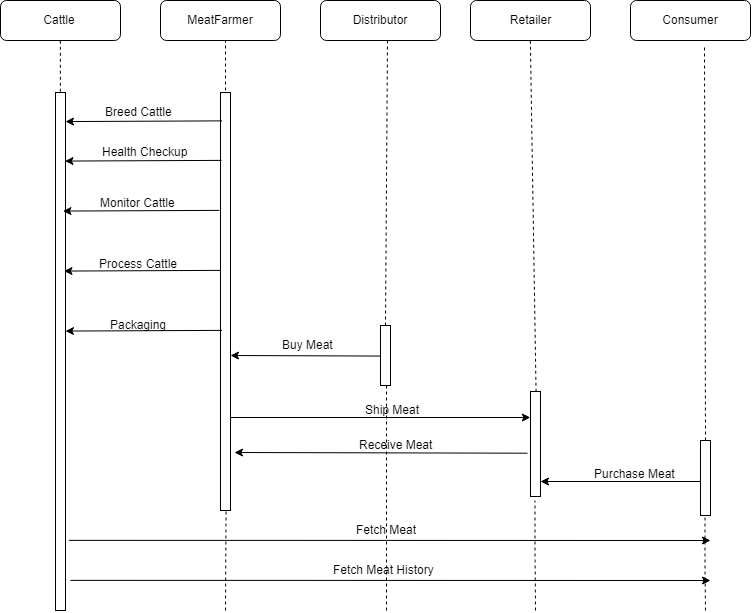
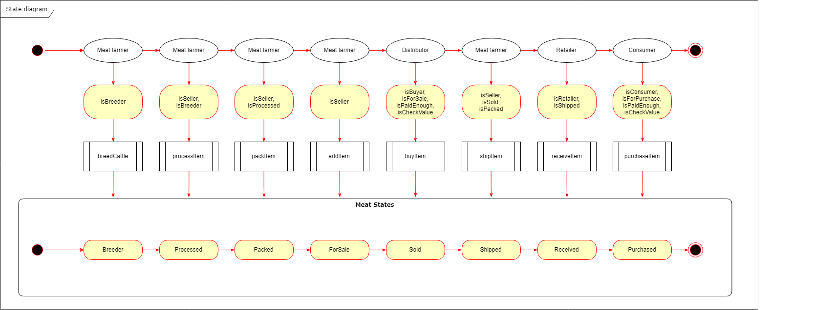
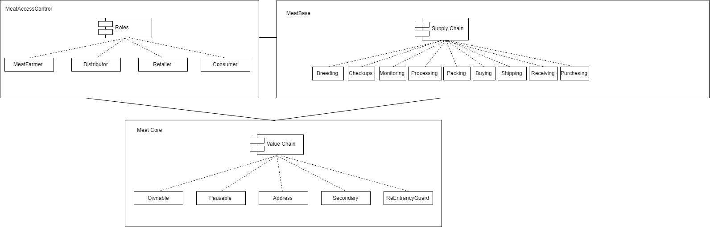
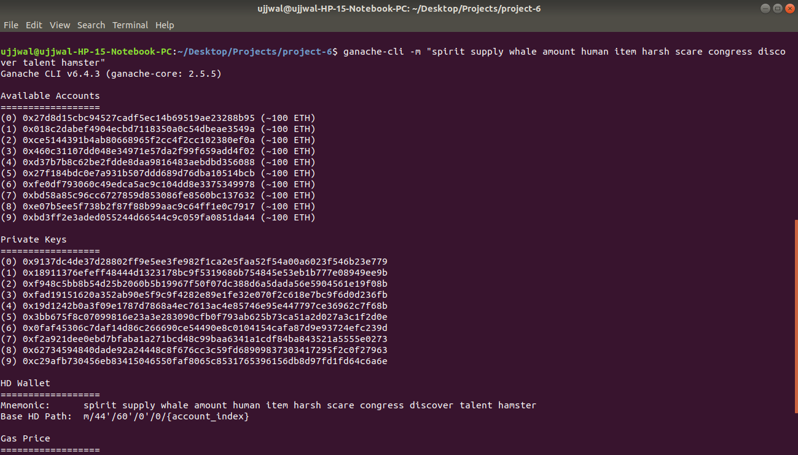
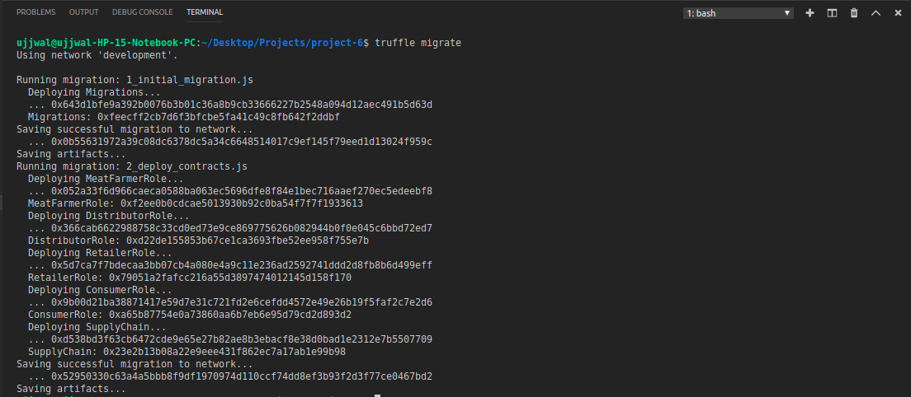
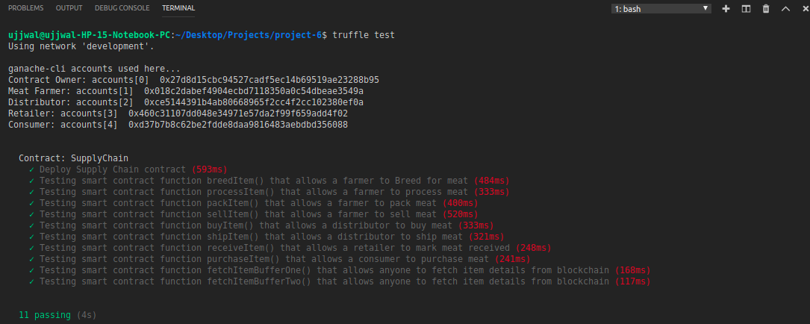
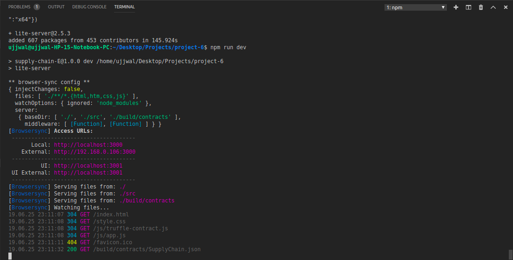

# Udacity Blockchain Nanodegree Program: Supply Chain project

This Project implements a simple dapp for supply chain structure of Meat farming and is primarily concerned with how the actors at each state of the cycle interact and what role they play.The user story is similar to any commonly used supply chain process. A seller can add items to the inventory system stored in the blockchain. A buyer can purchase such items from the inventory system. Additionally a seller can mark an item as shipped, and similarly a buyer can mark an item as received.


## UML diagrams
These UML diagrams represent and depict how the supply chain works and what role each actor plays.

### Activity diagram



### Sequence diagram



### State diagram



### Classes diagram




## Getting Started

These instructions will get you a copy of the project up and running on your local machine for development and testing purposes. See deployment for notes on how to deploy the project on a live system.

### Prerequisites

Please make sure you've already installed ganache-cli, Truffle and enabled MetaMask extension in your browser.


### Installing

A step by step series of examples that tell you have to get a development env running

Clone this repository

Change directory to ```project-6``` folder and install all requisite npm packages (as listed in ```package.json```):

```
cd project-6
npm install
```

Launch Ganache:

```
ganache-cli -m "spirit supply whale amount human item harsh scare congress discover talent hamster"
```

Your terminal should look something like this:



In a separate terminal window, Compile smart contracts:

```
truffle compile
```

Your terminal should look something like this:


This will create the smart contract artifacts in folder ```build\contracts```.

Migrate smart contracts to the locally running blockchain, ganache-cli:

```
truffle migrate
```

Your terminal should look something like this:



Test smart contracts:

```
truffle test
```

All 11 tests should pass.



In a separate terminal window, launch the DApp:

```
npm run dev
```

Your terminal should look something like this:


## Built With

* [Ethereum](https://www.ethereum.org/) - Ethereum is a decentralized platform that runs smart contracts
* [IPFS](https://ipfs.io/) - IPFS is the Distributed Web | A peer-to-peer hypermedia protocol
to make the web faster, safer, and more open.
* [Truffle Framework](http://truffleframework.com/) - Truffle is the most popular development framework for Ethereum with a mission to make your life a whole lot easier.


## Authors

See also the list of [contributors](https://github.com/your/project/contributors.md) who participated in this project.

## Acknowledgments

* Solidity
* Ganache-cli
* Truffle
* IPFS
