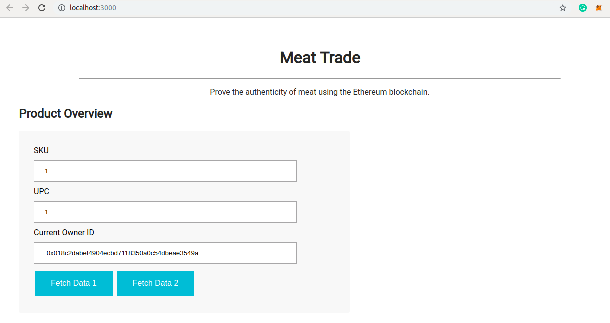
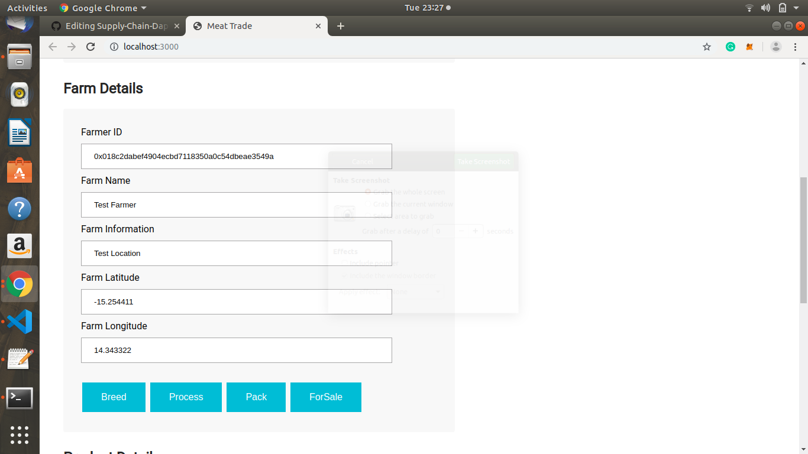
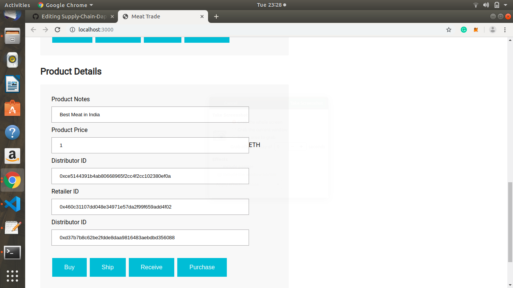

# Udacity Blockchain Nanodegree Program: Supply Chain project

This Project implements a simple dapp for supply chain structure of Meat farming and is primarily concerned with how the actors at each state of the cycle interact and what role they play.The user story is similar to any commonly used supply chain process. A seller can add items to the inventory system stored in the blockchain. A buyer can purchase such items from the inventory system. Additionally a seller can mark an item as shipped, and similarly a buyer can mark an item as received.


## UML diagrams
These UML diagrams represent and depict how the supply chain works and what role each actor plays.

### Activity diagram


### Sequence diagram


### State diagram


### Classes diagram


## Getting Started

These instructions will get you a copy of the project up and running on your local machine for development and testing purposes. See deployment for notes on how to deploy the project on a live system.

### Prerequisites

Please make sure you've already installed ganache-cli, Truffle and enabled MetaMask extension in your browser.


### Installing

A step by step series of examples that tell you have to get a development env running

Clone this repository

Change directory to ```project-6``` folder and install all requisite npm packages (as listed in ```package.json```):

```
cd project-6
npm install
```

Launch Ganache:

```
ganache-cli -m "spirit supply whale amount human item harsh scare congress discover talent hamster"
```

Your terminal should look something like this:


In a separate terminal window, Compile smart contracts:

```
truffle compile
```

Your terminal should look something like this:


This will create the smart contract artifacts in folder ```build\contracts```.

Migrate smart contracts to the locally running blockchain, ganache-cli:

```
truffle migrate
```

Your terminal should look something like this:


Test smart contracts:

```
truffle test
```

All 11 tests should pass.


To deploy the contract on Rinkeby Test network, use the following command

```
truffle migrate --reset --network rinkeby
```
Contract deployed at: https://rinkeby.etherscan.io/tx/0x377ccae36f3fbe49a72670bce26436039e80817c3b7980977fc8742dc8416abe

In a separate terminal window, launch the DApp:

```
npm run dev
```

Your terminal should look something like this:


Front end looks like this:







Breeded - 0x40d2d4de129cef347f653e14f7dda36ac901fee01f7a2b477c0646f9588ab1ec
Processed - 0xb1958b36a25455eaaa12bac19db3525c9974f05ec75d26a36fbedd4d3504140a
Packed - 0x49cf345f4ca6d3f66a38830b97033a89a0460448808d70d2d62536f1897cfb2e
ForSale - 0x5ef7a5404713a9cf4b5a37d4ccf738af7f3b8658e7048b25222931be346e2378
Sold - 0x5a7541a4cf62067765a835be1de3d24948ae219ae2dc3652fd18062b8744bde2
Shipped - 0xcf5330f9acab3ccaeed40c40715e3e3693edf45f75cf16e9b0415672f87a57e0
Received - 0x7a96d8256c83492fb3f5beeb76adb8f518f172eaaab7d6bd0f213ab354de91c9
Purchased - 0x64c8bcabba5c78b9b42f52918116400809403f6ef27fb1ed567bfba58c40f387

## Built With

* [Ethereum](https://www.ethereum.org/) - Ethereum is a decentralized platform that runs smart contracts

* [Truffle Framework](http://truffleframework.com/) - Truffle is the most popular development framework for Ethereum with a mission to make your life a whole lot easier.


## Acknowledgments

* Solidity
* Ganache-cli
* Truffle
